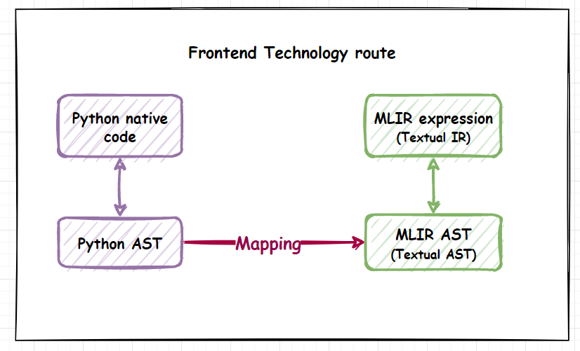
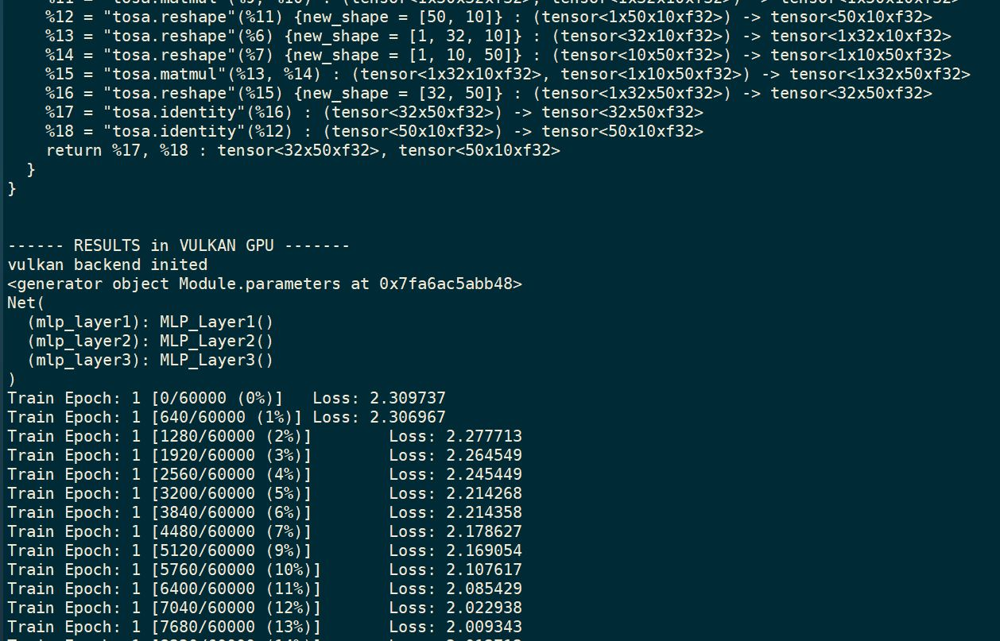
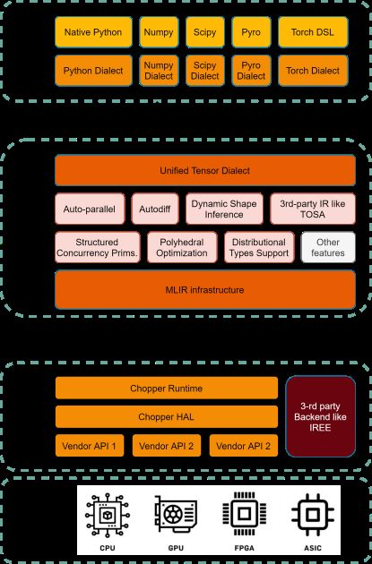

<div align=center>


</div>

# Chopper - Composable Computing Frameworks targeting Large-scale Heterogeneous Computing

Chopper is a computing framework prototype that is built with composite modularized design to achieve decoupleness between modules and ensure rapid prototyping and evolution speed. It builds with more flexible ways that allows you register new breed of frontend/backend implementations and compare with each other. It also relies on MLIR to provide fruitful manifolds and toolchains that allows you play with the IR design of the compiler part, the architecture is shown below. The runtime is built with RUST for maximal confidence in both memory and thread safety, and hence leverage the human hassles and efforts for maintainness largely.

# Status

## Key Features
- [x] A whole stack textual round-trippable IR system to enable easy debug and maintain
- [x] Decoupled build system setting, allows less-deps build and dev
- [x] Toolchains independently set up in frontend, compiler and runtime modules
- [x] Autodiff compilation
- [x] A decoupled and unified HAL design
- [x] Support plug-in for multiple frontends and backends
- [x] IREE supported as reference backend
- [x] additional runtime safety by pure Rust implementation

## Support Matrix
* Frontends
- [x] Torch
- [ ] Tensorflow
- [ ] Tensorflow Eager
- [ ] TVM
- [x] Native Python - frontend

* Compilation Specs
- [x] TOSA
- [ ] Spir-V

* Runtime
- [x] Vulkan GPU
- [ ] CUDA GPU
- [ ] Rocm
- [ ] Mali
- [x] X86
- [ ] Enflame DTU

## Upcoming Features
- [ ] Profiling
- [ ] Debug Info
- [ ] Auto-parallel
- [ ] Probabilistic Types and Compilation Support
- [ ] Differentiable Types and Compilation Support
- [ ] Transactional Actor Model for Concurrency Execution
- [ ] Structured Concurrecy Semantics in IR support
- [ ] Dynamic Resource Managements
- [ ] HAL refactored for GPU + DTU

# Getting Started

## Step 1 - build and install prerequisites
Currently, chopper is tested on Ubuntu 18.04 & 16.04, it should still work on other distribution versions of Ubuntu system, but not tested and verified yet.

Check if your develop environments fulfills:
* Python >= 3.6.9
* Cmake >= 3.13.4
* Rust >= 1.42.1
* Ninja >= 1.7.0

Then you can go to the root directory and run
``` sh
pip3 install -r requirements.txt
sudo apt install cmake ninja-build clang lld
```
to install the related preliminaries.

If you want to enable the GPU card, check this website https://vulkan.lunarg.com/doc/sdk/1.2.198.1/linux/getting_started_ubuntu.html to install the Vulkan API and its related requirements.

Please make sure you have already installed a compatible version of driver before install the Vulkan SDK. Normally, you can find it at the GPU vendor's website, i.e., Nvidia's official websites.

## Step 2 - build chopper
It support the a simple `python-like` installation with setuptools. This will install the standalone python modules into your OS envs.

To ensure that the entire project builds successfully, you need to make sure that the particular dependency version is installed correctly in advance, version requirements are available [here](https://llvm.org/docs/GettingStarted.html#requirements). Of course, you can also use clang & clang++(chosen and version is 11.1.0+) as the compiler instead of gcc/g++.

For convenience, there is a all-in-one script that automatically installs the LLVM nightly toolchain packages on the different Debian and Ubuntu versions (refer [here](https://apt.llvm.org/)). If you want to install a sepcific version of LLVM, for example, install version 11 as follow

```sh
wget https://apt.llvm.org/llvm.sh
chmod +x llvm.sh
sudo ./llvm.sh 11
```

After ensuring that all of the environment dependencies are ready, let's start building the project as follows

<font color=Blue>**STEP1**</font> The project depends on three externals included that llvm-project, pybind11 and pymlir, so them must be cloned firstly as follow.

```sh
git submodule init
git submodule update
```

After cloning is complete, llvm-project, pybind11 and pymlir will appear in the external directory.

<font color=Blue>**STEP2**</font> Build the Chopper, in order to build project successfully, the LLVM+MLIR must be build successfully first, here provide the complete build script as follow.

```shell
cd Chopper/
bash script/build_all.sh
bash script/install_all.sh
```

After build successfully, you can check the correctness by start the test script.
```shell
cd Chopper/
bash script/test_all.sh
```

Alternatively, you can also build **LLVM + MLIR** and **Chopper** seperately as shown below.

### Build LLVM + MLIR

If not familiar with building MLIR based on LLVM, please refer [here](https://mlir.llvm.org/getting_started/). Now build LLVM + MLIR as follow.

```sh
# top_dir_realpath="path/to/Chopper"
mkdir ${top_dir_realpath}/mlir_build
cd ${top_dir_realpath}/mlir_build
mkdir -p ${top_dir_realpath}/mlir_build/install_dir

cmake -G Ninja \
    ${top_dir_realpath}/external/llvm-project/llvm \
    -DLLVM_ENABLE_PROJECTS=mlir \
    -DLLVM_BUILD_EXAMPLES=ON \
    -DLLVM_TARGETS_TO_BUILD="X86" \
    -DCMAKE_BUILD_TYPE=RELEASE \
    -DLLVM_ENABLE_ASSERTIONS=ON \
    -DCMAKE_C_COMPILER=clang-11 \
    -DCMAKE_CXX_COMPILER=clang++-11 \
    -DCMAKE_INSTALL_PREFIX=${top_dir_realpath}/mlir_build/install_dir \
    -DLLVM_INSTALL_UTILS=ON \
    -DLLVM_BUILD_LLVM_DYLIB=ON \
    -DLLVM_LINK_LLVM_DYLIB=ON
```

<font color=Red>**Notice**</font>:

- Have to make sure build successfully, that is built LLVM + MLIR in `$BUILD_DIR=${top_dir_realpath}/mlir_build` and installed them to `$PREFIX=${top_dir_realpath}/mlir_build/install_dir`;

- Make sure to pass `-DLLVM_INSTALL_UTILS=ON` when building LLVM with CMake in order to install `FileCheck` to the chosen installation prefix.
  More easily, use `pip install filecheck && ln -s ${which filecheck} /usr/bin/FileCheck` to given the executable path of filecheck to cmake.

### Build Chopper Compiler

The prerequisite for a successful Chopper build is to ensure the successful LLVM + MLIR build. This setup assumes that you have built LLVM and MLIR in `$BUILD_DIR` and installed them to `$PREFIX`. To build Chopper as follow.

```sh
mkdir build && cd build
cmake -G Ninja .. -DMLIR_DIR=$PREFIX/lib/cmake/mlir -DLLVM_EXTERNAL_LIT=$BUILD_DIR/bin/llvm-lit -DCMAKE_BUILD_TYPE=DEBUG
cmake --build . --target <chopper-runner/chopper-opt/chopper-translate>
```

To build the documentation from the TableGen description of the dialect operations, please run

```sh
cmake --build . --target mlir-doc
```

### Build Chopper Frontend

Chopper is a multi-frontend design with preferred support for `native python` and `numpy+scipy`, And strive to design the frontend as uniformly functional expression as possible. The **Frontend Technology Route** is shown below.

<div align=center>



</div>

Let's try using `native python` firstly to implement front-end functionality, as follow.

Build and install python package

```sh
cd Chopper/
python3 setup.py install --record install_cache.txt
```

Now you should be able to run arbitrary python source

### Build Chopper Backend

In the seperated setting, you can clone and build the Chopper rust backend/runtime from source.

First do the clone and build with cargo

```sh
git clone git@git.enflame.cn:heng.shi/chopper-runtime.git
cargo build
```
Then you can run the regression test of Chopper-runtime by
```sh
cargo test
```

or run the runtime interpreter in interactive fashion by
```sh
cargo run --bin chopper-runtime
```
# Example
run the follow mnist training example source by python
```sh
python experimental/end2end_pytorch/mnist_training_iree.py
```
```sh
python experimental/end2end_pytorch/mnist_training_crt.py
```
And you will get similar verbose prints as belows.
<div align=center>
    


</div>


# Design and Implementation

Chopper project is raise by Enflame Evolutionary Academy, in order to construct a fast pace experimental platform to maximize the possibility to explore technical frontiers of computing frameworks with concrete prototyping work and ablation studies.

To this end, this project is the scaffolds for future research works and hence lack of many implementation details to boost the preformance at the early stage.

To the constrast, it fully equips with modularised functionalities and toolchains to make your prototyping work delightful and straight-forward.

The overall architecture design of Chopper system is demonstrated below.
<div align=center>
    


</div>

# Resources

## Website
To be added

## Documentations
To be added

## Presentations
To be added

# A Thanks To
In the design stage, this project also inspired by the idea and implementation practices of some related works, including:

1. mlir-npcomp: https://github.com/google/mlir-npcomp
2. Jax: https://github.com/google/jax
3. Swift for Tensorflow: https://github.com/tensorflow/swift
4. MLIR.jl: https://github.com/vchuravy/MLIR.jl
5. TVM: https://tvm.apache.org/
